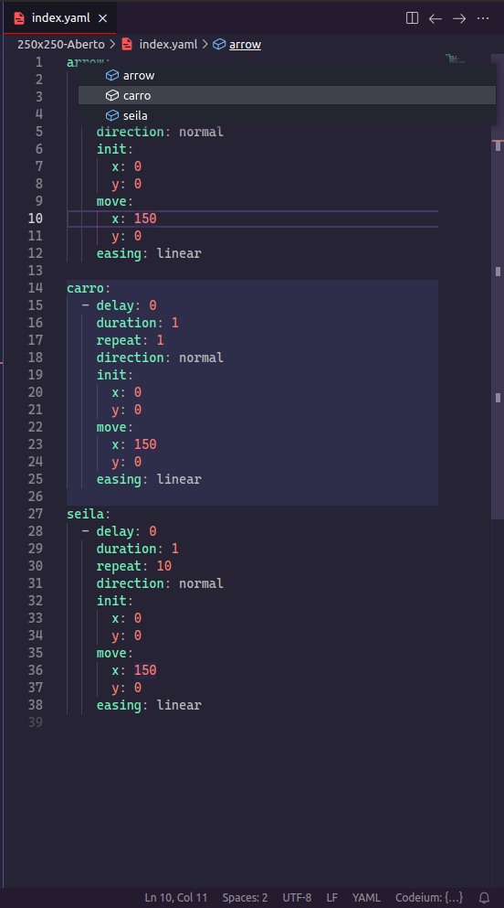

# YAML Navigator

Easily navigate through YAML files with our extension for Visual Studio Code.

## Features

Using the editor's Breadcrumb, you can quickly view and access different levels of structure in your YAML files, making navigation and editing more efficient. Ideal for developers working with complex configurations who need an intuitive way to explore their YAML documents.

### 1.0.0

Initial release.
